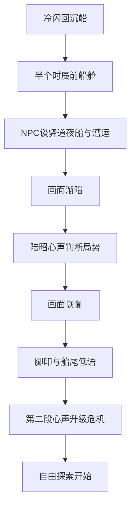

# 序章时代背景与主角心理活动方案

## 目标

在序章中加入两类内容：

1. 时代背景与人文要素：通过船客、船家、商人等 NPC 的自然对白说出，避免硬塞旁白。
2. 主角心理活动桥段：在关键节点让画面逐渐变暗，进入陆昭内心独白，表达他对当前处境、时代环境和案情风险的判断。

## 现状分析

### 已有数据流

序章主线由 [`prologue_nodes.csv`](data/case_tables/prologue_ferry/prologue_nodes.csv) 和 [`prologue_lines.csv`](data/case_tables/prologue_ferry/prologue_lines.csv) 驱动，运行时由 [`CaseTableLoader._compile_prologue()`](scripts/core/CaseTableLoader.gd:1035) 编译成叙述树。

NPC 对话由 [`dialogue_nodes.csv`](data/case_tables/prologue_ferry/dialogue_nodes.csv) 和 [`dialogue_lines.csv`](data/case_tables/prologue_ferry/dialogue_lines.csv) 驱动，运行时由 [`DialogueManager._resolve_dialogue_pages()`](scripts/dialogue/DialogueManager.gd:224) 转成逐页台词。

序章叙述进入时调用 [`DialogueManager.start_narration()`](scripts/dialogue/DialogueManager.gd:418)，每个节点通过 [`DialogueManager._emit_narration()`](scripts/dialogue/DialogueManager.gd:488) 发给主界面，再由 [`MainGame._on_narration_started()`](scripts/main/MainGame.gd:1684) 调用对话框显示。

### 已有演出能力

当前已经支持以下效果：

- 背景图切换：由 [`MainGame._on_narration_started()`](scripts/main/MainGame.gd:1684) 处理。
- 时间卡片：由 [`DialogueManager._emit_narration()`](scripts/dialogue/DialogueManager.gd:488) 和 [`MainGame._on_narration_time_card()`](scripts/main/MainGame.gd:1723) 处理。
- 震屏、闪屏、色调、音效：由 [`MainGame._on_narration_effects()`](scripts/main/MainGame.gd:1792) 处理。
- 黑蓝色调已有先例：[`MainGame._on_narration_effects()`](scripts/main/MainGame.gd:1811) 可处理 dark_blue 与 clear。
- 对话框内已有闪屏遮罩：[`DialogueBox.flash_screen()`](scripts/ui/DialogueBox.gd:701)。

### 关键限制

序章加载器目前在 [`CaseTableLoader._compile_prologue()`](scripts/core/CaseTableLoader.gd:1035) 中，每个 node 只读取 [`prologue_lines.csv`](data/case_tables/prologue_ferry/prologue_lines.csv) 的第一行作为 text 与 speaker。这意味着如果想让一个序章节点连续播放多句台词，不能只在同一个 node 下加多行；必须：

1. 为每句新增一个 node；或
2. 扩展加载器与叙述系统，让序章节点支持多页 lines。

从风险和工作量看，短期建议采用方案 1：新增多个序章节点串起来；长期若要大量写演出型序章，再考虑方案 2。

## 叙事设计建议

### 时代背景应放在哪里

建议放在序章的半个时辰前，即现有节点 cabin_prologue_1 到 cabin_prologue_6 之间。这里还没有正式案发，适合让人物自然谈到：

- 万历后期漕运、账弊、官商勾连。
- 荆江渡口水路复杂，船民靠天吃饭。
- 夜船虽然危险，但商人为了赶市、避税、抢时辰会冒险。
- 驿道泥坡塌方、驿站人浮于事，表现基层交通和行政衰败。
- 仆役和雇工处境艰难，为阿贵后续动机预埋情绪。

### 时代背景由谁说

建议优先使用现有序章同船人物，不新增立绘需求：

| 人物 | 可承载内容 | 语气 |
|---|---|---|
| 周德茂 | 商人逐利、赶武昌早市、货税、人情路子 | 精明、现实 |
| 老范 | 荆江水路、暗礁、夜船规矩、船民生计 | 粗粝、老江湖 |
| 阿贵 | 仆役处境、主仆关系、底层人不敢多嘴 | 怯懦、压抑 |
| 陆昭 | 漕运账弊、隐藏身份、官场风险 | 克制、冷静 |

### 主角心理活动触发点

建议加入三处，不宜过多：

1. 身份与时代压力：在 cabin_prologue_1 后，说明他为何隐藏身份，以及这趟差事牵涉漕运账弊。
2. 听到 NPC 谈夜船与水路后：画面变暗，陆昭判断此行不像普通绕路。
3. 发现脚印和催促声后：画面变暗，陆昭明确感到船上有人在等一个时辰，危机感升级。

### 心理活动文字风格

建议使用第一人称，短句，偏冷静，不要大段解释：

- 「这不是一条普通夜船。」
- 「漕运的账，最怕见光；而我此行，偏偏带着光。」
- 「如果有人知道我的身份，那么这场雨、这条船、这句催促，都不再是巧合。」

## 技术实现方案

### 方案 A：仅使用现有能力，低风险

做法：

1. 在 [`prologue_nodes.csv`](data/case_tables/prologue_ferry/prologue_nodes.csv) 中新增若干节点，例如 background_context_1、mind_1_fade_in、mind_1_text、mind_1_fade_out。
2. 在 [`prologue_lines.csv`](data/case_tables/prologue_ferry/prologue_lines.csv) 中为每个节点写一行文字。
3. 使用现有 fx：
   - 心理活动前：设置 tint 为 dark_blue 或 flash 为 black。
   - 心理活动后：设置 tint 为 clear。
4. 时代背景台词可以写成序章叙述节点，也可以写进船上 NPC 的普通对话。

优点：不用改代码，风险最低。
缺点：画面逐渐变暗的效果比较粗糙，只能依赖现有 tint 或 flash，无法做专门的心理活动 UI。

### 方案 B：扩展一个专门的心理活动演出，推荐

做法：

1. 扩展 [`MainGame._on_narration_effects()`](scripts/main/MainGame.gd:1792)，新增 mind_fade_in、mind_fade_out 或 tint_alpha 类效果。
2. 扩展 [`DialogueBox.show_narration()`](scripts/ui/DialogueBox.gd:175)，识别 narration type 或 speaker 为「陆昭·心声」，进入不同显示风格。
3. 在 [`prologue_nodes.csv`](data/case_tables/prologue_ferry/prologue_nodes.csv) 中通过 fx 标记心理活动节点，例如 mind_fade_in 与 mind_fade_out。
4. 在 [`prologue_lines.csv`](data/case_tables/prologue_ferry/prologue_lines.csv) 写心理活动正文。

优点：能稳定做出「画面逐渐变暗 -> 内心独白 -> 逐渐恢复」的效果，并且以后所有案件可复用。
缺点：需要改少量 GDScript。

### 方案 C：扩展序章多页 lines，适合长期

做法：

1. 修改 [`CaseTableLoader._compile_prologue()`](scripts/core/CaseTableLoader.gd:1035)，让一个序章 node 可以保留多行 lines。
2. 修改 [`DialogueManager._emit_narration()`](scripts/dialogue/DialogueManager.gd:488)，让叙述模式像普通对话一样支持 pages。
3. 修改 [`DialogueBox.show_narration()`](scripts/ui/DialogueBox.gd:175)，支持序章节点内连续点击多句。

优点：作者体验更好，序章脚本更集中。
缺点：涉及底层叙述模式改造，测试范围更大。

## 推荐方案

推荐采用 B，并暂不做 C。

原因：用户想要的是明确的心理活动演出，不只是文本补充。B 能满足「画面逐渐变暗，然后主角阐述内心想法」这个核心体验，同时不需要大幅改叙述系统的数据结构。

## 建议执行步骤

1. 在 [`prologue_nodes.csv`](data/case_tables/prologue_ferry/prologue_nodes.csv) 中插入三组心理活动节点，并调整 next 串联。
2. 在 [`prologue_lines.csv`](data/case_tables/prologue_ferry/prologue_lines.csv) 中补充时代背景 NPC 台词与陆昭内心独白。
3. 在 [`MainGame._on_narration_effects()`](scripts/main/MainGame.gd:1792) 中加入可配置的黑幕渐变效果，例如 mind_fade 与 tint_alpha。
4. 在 [`DialogueBox.show_narration()`](scripts/ui/DialogueBox.gd:175) 或说话者处理逻辑中，为「陆昭·心声」提供无立绘、低音量、偏内心独白的显示风格。
5. 测试序章完整点击流程，确认每个新增节点都能顺利推进到 cabin_free_explore。
6. 测试 tint 或 mind_fade 在序章结束后能恢复，避免进入自由探索后画面仍然发暗。

## 流程示意

## 待确认问题

1. 时代背景的密度：更偏历史氛围，还是更偏案件线索？
2. 心理活动风格：偏严肃推理，还是保留一点陆昭的冷幽默内心 OS？
3. 技术边界：是否允许为了心理活动改少量 GDScript，还是只接受 CSV 文本调整？
